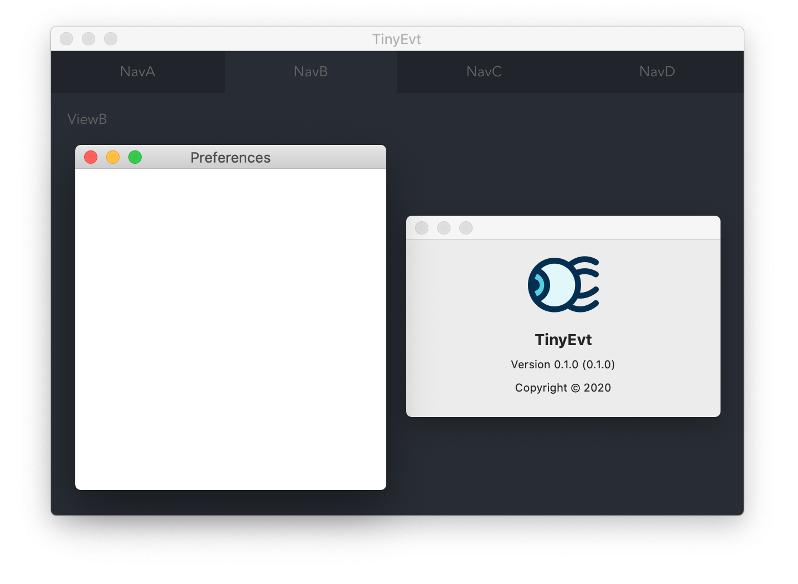

# *tiny-evt*



包含测试（ 支持 HMR ）、应用打包功能的极简 `(e)lectron`+`(v)ue`+`(t)ypeScript` 项目基础代码。

感谢 [Vite](https://github.com/vuejs/vite) 、[esbuild](https://github.com/evanw/esbuild) 项目，编程前的准备工作从未如此简单，且开发过程中具有更快的启动、HMR、编译打包速度。

> 关于 Vite 项目：
>
> *It's more like a more streamlined, opinionated development workflow tool. Think webpack-dev-server + webpack but lighter, faster, and pre-configured.*
>
> &mdash; Evan You ( [@youyuxi](https://twitter.com/youyuxi/status/1258112624300118022) ) May 6, 2020

---
> 依赖数量 - tiny！

| 依赖名称 | 类型 | 版本
| :---:|:---:|:---:|
| `vue-router` || `^4.0.0-alpha.10`
| `@vue/compiler-sfc` | `dev` | `^3.0.0-alpha.10`
| `electron` | `dev` | `^8.2.5`
| `electron-builder` | `dev` | `^22.6.0`
| `vite` | `dev` | `^0.15.1`

---

> 启动测试：

```bash
# 启动本地服务器运行 Vue 应用
# Renderer Process ( Vue APP ) ---> Vite-dev-server ---> localhost:3000

# 利用 Vite 中引入的 esbuild 编译打包 Main Process
# Main Process ( TypeScript APP ) ---> esbuild.build() ---> build/main.js

# 开发版环境下，测试版本 Electron 应用指向本地 Vite 测试服务器
# main-window @ TinyEvt ( development ) ---> localhost:3000

npm run dev
```

> 应用打包：

```bash
# 编译打包 Renderer Process
# Renderer Process ( Vue APP ) ---> Vite.build() ---> 【 HTML、CSS、JavaScript、etc.】@ build/renderer/

# 编译打包 Main Process
# Main Process ( TypeScript APP ) ---> esbuild.build() --->【 main.js、etc. 】@ build/

# 打包应用
# resources/**/* ---> electron-builder ---> build/resources/
# build/**/* ---> electron-builder ---> dist/

# 以可分发格式打包后的 Electron 应用指向 Vue 应用打包后的本地文件
# main-window @ TinyEvt（ packed，DMG 格式 ）---> build/renderer/index.html

npm run dist
```
