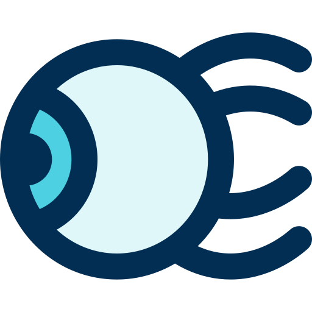

<div align="center">
  
  <p><b><i>tiny-evt</i></b></p>
  <p>
    
    
    
    
  </p>
  <p>由 Vite 驱动，使用 TypeScript、Vue 开发 Electron 应用的项目基础代码</p>
  <p>简洁易用，准备工作更少，运行、HMR、打包速度更快！遵循 <a href="https://www.electronjs.org/docs/tutorial/security">安全建议</a>、包含自动化测试构建</p>
  
</div>

> 依赖列表

| Dependence          | Category  | Required | Version          | Information |
| :---:               |:---:      |:---:     |:---:             |:---:|
| `vue-router`        |           |          | `4.0.0-alpha.11` |
| `env-cmd`           | `dev`     |          | `10.1.0`         |
| `cypress`           | `dev`     |          | `4.7.0`          | 测试工具
| `spectron`          | `dev`     |          | `11.0.0`         | 测试工具
| `@vue/test-utils`   | `dev`     |          | `2.0.0-alpha.6`  | 测试工具
| `jest`              | `dev`     |          | `26.0.1`         | 测试工具
| `@vue/compiler-sfc` | `dev`     | `true`   | `3.0.0-beta.14`  | 版本必须匹配 `vite` 中的 `vue` 版本
| `electron`          | `dev`     | `true`   | `9.0.0`          |
| `electron-builder`  | `dev`     | `true`   | `22.6.0`         |
| `vite`              | `dev`     | `true`   | `0.20.2`         | 包含 `vue@3.0.0-beta.14`、`esbuild`

---

> First Run

```bash
# 第一步
cd tiny-evt && npm install && cp configs/.env-cmdrc.json .

# 第二步，修改 ./.env-cmdrc.json 文件
"dist": {
  "CSC_IDENTITY_AUTO_DISCOVERY": false,
  "PUBLISH_BUILD": false
}

应用包含 GitHub Graphql API 调用，需填写 "GITHUB_TOKEN" 字段，如留空则使用 Mock 数据代替真实请求
```

---

> 运行应用

```bash
# 编译脚本
# scripts/dev-runner.ts ---> esbuild.build() ---> build/dev-runner.js

# 运行脚本（ 环境变量，NODE_ENV=development ）
# node build/dev-runner.js

# 脚本执行操作 - 启动本地服务器运行 Renderer Process ( Vue APP )
# renderer/**/* ---> Vite ---> dev-server @ localhost:3000

# 脚本执行操作 - 利用 Vite 中引入的 esbuild 编译打包 Main Process ( TypeScript APP )
# main/**/* ---> esbuild.build() ---> build/main.js、build/preload.js

# 脚本执行操作 - 运行 Electron 应用
# electron ---> build/main.js

# 开发版环境下，测试版本 Electron 应用的 main-window 指向本地 Vite-dev-server
# main-window @ TinyEvt @ development ---> localhost:3000

npm run dev
```

---

> 运行测试

```js
/**
 * 测试类型：`Unit Testing`
 * 测试目标：`Components @ Vue App @ Renderer`
 * 测试工具：`Vue Test Utils`、`Jest`
 *
 * 编译脚本
 * scripts/dev-runner.ts ---> esbuild.build() ---> build/dev-runner.js
 *
 * 运行脚本（ 环境变量 NODE_ENV=development、TEST=components ）
 * node build/dev-runner.js
 *
 * 脚本执行操作 - 编译 Tests ( 利用既有 vite 配置，无缝支持解析 .vue 文件以及编译 TypeScript )
 * tests/vue/*.spec.ts ---> Vite.build() ---> tests/vue/build/*.js
 *
 * 脚本执行操作 - 启动 Jest 运行测试用例 ( tests/vue/build/*.js )
 */

npm run vtu
```

```js
/**
 * 测试类型：`Integration Testing`
 * 测试目标：`Electron App`
 * 测试工具：`Spectron`、`Jest`
 *
 * 编译脚本
 * scripts/dev-runner.ts ---> esbuild.build() ---> build/dev-runner.js
 *
 * 运行脚本（ 环境变量 NODE_ENV=development、TEST=spectron ）
 * node build/dev-runner.js
 *
 * 脚本执行操作 - 启动本地服务器运行 Renderer Process ( Vue APP )
 * renderer/* ---> Vite ---> dev-server @ localhost:3000
 *
 * 脚本执行操作 - 编译打包 Main Process ( TypeScript APP )
 * main/* ---> esbuild.build() ---> build/main.js、build/preload.js
 *
 * 脚本执行操作 - 编译 Tests
 * tests/spectron/*.ts ---> esbuild.build() ---> tests/spectron/*.js
 *
 * 脚本执行操作 - 启动 Jest 调用 Spectron 运行 Electron App ( 测试应用启动文件指向 build/main.js ) 进行测试
 */

npm run spectron
```

```js
/**
 * 测试类型：`End-to-End Testing`
 * 测试目标：`Vue App @ Renderer`
 * 测试工具：`Cypress`
 *
 * 编译脚本
 * scripts/dev-runner.ts ---> esbuild.build() ---> build/dev-runner.js
 *
 * 运行脚本（ 环境变量 NODE_ENV=development、TEST=cypress ）
 * node build/dev-runner.js
 *
 * 脚本执行操作 - 启动本地服务器运行 Renderer Process ( Vue APP )
 * renderer/* ---> Vite ---> dev-server @ localhost:3000
 *
 * 脚本执行操作 - 启动 Cypress 测试（ tests/cypress/integration/*.spec.ts，测试页面指向 localhost:3000 ）
 *
 * 测试及构建环境下 Cypress 的使用方式存在区别：process.env.CI ? cypress run : cypress open
 */

npm run cypress
```

---

> 应用打包

```bash
# 编译脚本
# scripts/app-builder.ts ---> esbuild.build() ---> build/app-builder.js

# 运行脚本
# node build/app-builder.js

# 脚本执行操作 - 编译打包 Renderer Process ( Vue APP )
# renderer/**/* ---> Vite.build() ---> build/renderer/

# 脚本执行操作 - 编译打包 Main Process ( TypeScript APP )
# main/**/* ---> esbuild.build() ---> build/main.js、build/preload.js

# 脚本执行操作 - 打包创建应用
# package.json ---> electron-builder ---> dist/~app.asar/package.json
# build/**/*（ dev-runner.js、app-builder.js 除外 ）---> electron-builder ---> dist/~app.asar/build/
# main/resources/**/* ---> electron-builder ---> dist/~app.asar/build/resources/
# dist/mac/**/* ---> electron-builder ---> dist/TinyEvt.dmg

# 以可分发格式打包后的 Electron 应用指向 Vue 应用打包后的本地文件
# main-window @ TinyEvt（ packaged，DMG 格式 ）---> app.asar/build/renderer/index.html

# 注意：本机环境下执行打包操作时，默认忽略 `Code Signing` 以及 `publish` 操作

npm run dist
```

---

> GitHub Workflow

```bash
# Build & Release

# 1. 更新 `package.json` 中的版本号，例如从 `v1.2.2` 变更至 `v1.2.3`
# 2. `git commit -am v1.2.3`
# 3. `git tag v1.2.3`，使用指定的命名格式 `v*.*.*`
# 4. `git push && git push --tags`
# 5. 指定格式标签的推送事件会触发 GitHub Actions 自动创建 Release v1.2.3、打包生成不同平台格式的应用并发布
```

```bash
# Build & Release - Code Signing @ macOS runner

# 1. 导出与应用相关的所有证书至单个文件 `certs.p12`，并设置强密码
# 2. 运行命令 `base64 -i certs.p12 -o encoded.txt` 对导出文件进行编码
# 3. 在项目仓库的 `Secrets` 设置项中添加 `mac_certs`（ 即 `encoded.txt` 的内容 ）
# 4. 在项目仓库的 `Secrets` 设置项中添加 `mac_certs_password`（ 即导出证书时设置的密码 ）
# 5. 在 `.github/workflows/build-release.yml` 中添加 `CSC_LINK`, `CSC_KEY_PASSWORD` 环境变量配置

# .github/workflows/build-release.yml
# - name: Build App and publish
#   env: |
#     CSC_LINK: ${{ secrets.CSC_LINK }}
#     CSC_KEY_PASSWORD: ${{ secrets.CSC_KEY_PASSWORD }}
```

---

> Sponsor

```ts
// 非职业前端，出于研究以及自用目的创建此项目
// 请调用以下函数来判断是否要赞助此项目：

enum Comment {
    NotBad = '还不错',
    DidHelped = '确实有所帮助',
    Sorry = '毫无感觉'
}

function makeDecision (comment: Comment, willingToSponsor: boolean) {
  if (( comment === Comment.NotBad || comment === Comment.DidHelped ) && willingToSponsor ) {
    console.log('请点击当前页面顶部的 “Sponsor” 按钮')
  } else {
    console.log('能理解')
  }
}
```
