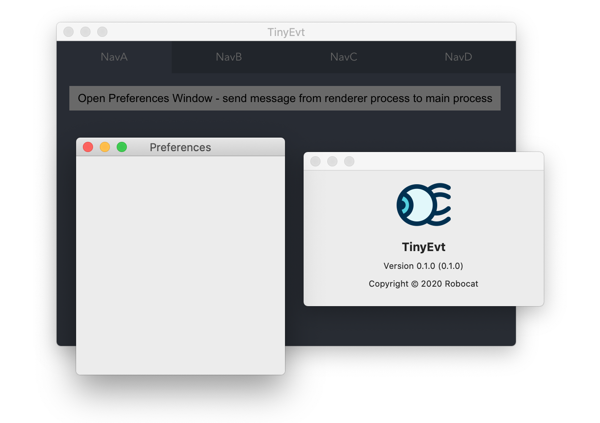

# *tiny-evt*


基于 [Vite](https://github.com/vitejs/vite) 实现，使用 `TypeScript`、`Vue` 开发 `Electron` 应用的项目基础代码。

依赖、配置、使用简单，编程前准备工作更少，运行、HMR、编译打包速度更快！遵循 [安全建议](https://www.electronjs.org/docs/tutorial/security)、包含自动化测试构建。



---

> 依赖列表

| Dependence          | Category  | Required | Version          | Information |
| :---:               |:---:      |:---:     |:---:             |:---:|
| `vue-router`        |           |          | `4.0.0-alpha.11` |
| `env-cmd`           | `dev`     |          | `10.1.0`         |
| `cypress`           | `dev`     |          | `4.7.0`          | 测试工具
| `spectron`          | `dev`     |          | `11.0.0`         | 测试工具
| `@vue/test-utils`   | `dev`     |          | `2.0.0-alpha.6`  | 测试工具
| `jest`              | `dev`     |          | `26.0.1`         | 测试工具
| `@vue/compiler-sfc` | `dev`     | `true`   | `3.0.0-beta.14`  | 版本必须匹配 `vite` 中的 `vue` 版本
| `electron`          | `dev`     | `true`   | `9.0.0`          |
| `electron-builder`  | `dev`     | `true`   | `22.6.0`         |
| `vite`              | `dev`     | `true`   | `0.20.2`         | 包含 `vue@3.0.0-beta.14`、`esbuild`

---

> Workflow - Build & Release

```bash
# 步骤 1 - 更新 `package.json` 中的版本号，例如从 `v1.2.2` 变更至 `v1.2.3`

# 步骤 2 - `git commit -am v1.2.3`

# 步骤 3 - `git tag v1.2.3`，使用指定的命名格式 `v*.*.*`

# 步骤 4 - `git push && git push --tags`

# 步骤 5 - 指定格式标签的推送事件会触发 GitHub Actions 自动创建 Release v1.2.3、打包生成不同平台格式的应用并发布
```

---

> First Run

```bash
# 第一步
cd tiny-evt && npm install && cp configs/.env-cmdrc.json .

# 第二步，修改 ./.env-cmdrc.json 文件
"dist": {
  "CSC_IDENTITY_AUTO_DISCOVERY": false,
  "PUBLISH_BUILD": false
}

应用包含 GitHub Graphql API 调用，需填写 "GITHUB_TOKEN" 字段，如留空则使用 Mock 数据代替真实请求
```

---

> 运行应用

```bash
# 编译脚本
# scripts/dev-runner.ts ---> esbuild.build() ---> build/dev-runner.js

# 运行脚本（ 环境变量，NODE_ENV=development ）
# node build/dev-runner.js

# 脚本执行操作 - 启动本地服务器运行 Renderer Process ( Vue APP )
# renderer/**/* ---> Vite ---> dev-server @ localhost:3000

# 脚本执行操作 - 利用 Vite 中引入的 esbuild 编译打包 Main Process ( TypeScript APP )
# main/**/* ---> esbuild.build() ---> build/main.js、build/preload.js

# 脚本执行操作 - 运行 Electron 应用
# electron ---> build/main.js

# 开发版环境下，测试版本 Electron 应用的 main-window 指向本地 Vite-dev-server
# main-window @ TinyEvt @ development ---> localhost:3000

npm run dev
```

---

> 运行测试

| 测试类型        |  测试工具                    | 测试目标                             | 命令 |
| :---:         | :---:                       | :---:                               | :---: |
| `Unit`        | `Vue Test Utils`、`Jest`    | `Components @ Vue App @ Renderer`  | `npm run vtu`
| `End-to-End`  | `Cypress`                   | `Vue App @ Renderer`                | `npm run cypress`
| `Integration` | `Spectron`、`Jest`          | `Electron App`                      | `npm run spectron`

<!-- > 运行 E2E 测试 -->

```bash
# 编译脚本
# scripts/dev-runner.ts ---> esbuild.build() ---> build/dev-runner.js

# 运行脚本（ 环境变量 NODE_ENV=development、TEST=cypress ）
# node build/dev-runner.js

# 脚本执行操作 - 启动本地服务器运行 Renderer Process ( Vue APP )
# renderer/**/* ---> Vite ---> dev-server @ localhost:3000

# 脚本执行操作 - 启动 Cypress Test Runner

npm run cypress
```

<!-- > 测试 Electron 应用 -->

```bash
# 编译脚本
# scripts/dev-runner.ts ---> esbuild.build() ---> build/dev-runner.js

# 运行脚本（ 环境变量 NODE_ENV=development、TEST=spectron ）
# node build/dev-runner.js

# 脚本执行操作 - 启动本地服务器运行 Renderer Process ( Vue APP )
# renderer/**/* ---> Vite ---> dev-server @ localhost:3000

# 脚本执行操作 - 编译打包 Main Process ( TypeScript APP )
# main/**/* ---> esbuild.build() ---> build/main.js、build/preload.js

# 脚本执行操作 - 编译 Mocha Tests
# tests/**/*.ts ---> esbuild.build() ---> tests/**/*.js

# 脚本执行操作 - 启动 Mocha 调用 Spectron 运行 Electron App ( ---> build/main.js ) 进行测试

npm run spectron
```

<!-- > 测试 Vue 组件 -->

```bash
# 编译脚本
# scripts/dev-runner.ts ---> esbuild.build() ---> build/dev-runner.js

# 运行脚本（ 环境变量 NODE_ENV=development、TEST=components ）
# node build/dev-runner.js

# 脚本执行操作 - 编译 Tests ( 利用既有 vite 预置编译功能，以支持 import .vue 文件以及 TypeScript 转换 )
# vue/**/*.ts ---> Vite.build() ---> vue/**/*.js

# 脚本执行操作 - 启动 Jest 运行测试用例

npm run vtu
```

---

> 本地应用打包

```bash
# 编译脚本
# scripts/app-builder.ts ---> esbuild.build() ---> build/app-builder.js

# 运行脚本
# node build/app-builder.js

# 脚本执行操作 - 编译打包 Renderer Process ( Vue APP )
# renderer/**/* ---> Vite.build() ---> build/renderer/

# 脚本执行操作 - 编译打包 Main Process ( TypeScript APP )
# main/**/* ---> esbuild.build() ---> build/main.js、build/preload.js

# 脚本执行操作 - 打包创建应用
# package.json ---> electron-builder ---> dist/~app.asar/package.json
# build/**/*（ dev-runner.js、app-builder.js 除外 ）---> electron-builder ---> dist/~app.asar/build/
# main/resources/**/* ---> electron-builder ---> dist/~app.asar/build/resources/
# dist/mac/**/* ---> electron-builder ---> dist/TinyEvt.dmg

# 以可分发格式打包后的 Electron 应用指向 Vue 应用打包后的本地文件
# main-window @ TinyEvt（ packaged，DMG 格式 ）---> app.asar/build/renderer/index.html

npm run dist
```
